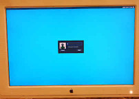

# Public Dot Files

My configuration dot files, taken mostly from the Thinkpad T60, while running either OpenBSD and/ or Debian.

##  Xscreensaver
My Xscreensaver setup ([larger image](Pics/DSCN0052.00.jpg)) that tries to add some beauty and coolness to the dreadful default look that Xscreensaver has out of the box.  
The configuration file that controls the way it look is thru [~/.Xresources](https://github.com/eam-00/Dot-Files-Pub/blob/master/.Xresources).

##  LightDM
My current [LightDM](https://github.com/canonical/lightdm) [setup](https://github.com/eam-00/Dot-Files-Pub/blob/master/lightdm-gtk-greeter.conf) on Debian Stable ([larger image](Pics/DSCN0086.00.jpg)).  
Nice, minimal and flat looking, at least IMHO.
